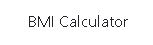
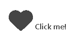

# Pro Gainer

## [ --> View the live deployed project here <-- ](https://pro-gainer-85d1fcf0b9b4.herokuapp.com/)

## Table of contents

## UX
### Strategy
#### Project overview

Welcome to Pro Gainer, a website for individuals to subscribe to a gym membership to have access to the Pro Gainer gym. Members have access to our fantastic premium content of being able to save and access a wide array of different exercises, instructional material on each of these exercises and the ability to keep them in your favourites list. 

The website is focused on providing a gym subscription service for the physical gym which our members can attend, it is located in the heart of hounslow in greater london. Alongside the access for our amazing gym users will be able to access our publicly available exercise list and save any item within this list. Our target clients for the website are a mix of amateur gym enthusiasts, younger individuals  looking to get fit and older individuals looking to stay fit.  

<!-- The website is made using the django framework, each different component is going to be categorized into their own apps. The apps we have in this project consists of the  membership and exercise app. The membership app will -->

#### Project goals

The primary goals of this project are listed below.

- Increase gym revenue through online membership applications

- Translate website visitors into paying customers

- Assist our current members with our online exercise resources to increase customer retention and satisfaction

- Easily add and edit exercises on the website 

Through the easy navigation of the website and smooth UX, the website is an inviting experience for any user. Our clients attending our gym can now use our website as a guide for exercises they may perform in the gym improving each customer's results and satisfaction. 

#### User stories

At the highest level we have used Epics to categorize our user stories into separate blocks based on the needs of the end user. Each Epic will contain multiple user stories 
and each user stories will themselves contain multiple *acceptance criteria* to dictate the expectations of our clients and *tasks* for the developers to be able to further breakdown the work into smaller more manageable pieces.

To be able to better prioritise, organise and communicate the intended project features we have come up with our set of User Stories. These will be our guide from project inception to create the features within our website until project delivery. These user stories plays a crucial role into the needs and necessary features that an end user would want in the website. The user stories were organised and prioritised using a project view board in github projects which can be found [Here](https://github.com/users/JamesBracken/projects/15/views/5).

**User content(Epic)**
 
 - As a user, I would like access to a navigation bar and footer so I can easily navigate the website(Must have)

 - As a user, I would like the site to be responsive so I can access it on multiple devices(Must have)
 
 - As a user, I would like to have access to a list of exercises so that I can gather inspiration for my next workout(Must have)
 
 - As a user, I would like to have access to details of each exercise so I can get a better grasp of each individual exercise(Must have)
 
 - As a user, I would like to be informed of any discounts the gym may be doing so I can save money(Should have)
 
 - As a user, I would like to have access to a gallery so I can view pictures of the gym and understand if it is right for me(Could have)
 
 - As a user, I would like to be able to book a visit so I can decide if the gym is right for me(Could have)

**Membership and authentication(Epic)**
 
 - As an interested customer, I would like to be able to register, sign in and sign out so I can access my membership benefits(Must have)
 
 - As an interested customer, I would like to be able to subscribe for a membership so I can access premium website functionality(Must have, 
 this user story was originally --As an interested customer, I would like to be able to pay for my membership with a recurring fee so I dont need to worry about paying.
 This user story was altered after initially setting this due to being out of scope of the project. More about this on user story testing)
 
 - As a signed-in user, I would like to be able to cancel my membership so I can stop my gym payments(Originally Must have, now Wont do as recurring payments
 will no longer be applied in the project there is no further need for a cancel membership functionality)

**Members only content(Epic)**
 
 - As a signed-in user, I would like to be able to save exercises as favourites so I can easily come back to them(Must have)
 
 - As a signed-in user, I would like to be able to filter the exercises in my favourites list so I can easily access specific exercises (Should 
 have)
 
 - As a signed-in user, I would like to be able to add my fitness goals 
 so I can have them on my profile(Should have)
 
 - As a signed-in user, I would like to be able to update my fitness goals so I can keep it updated(Should have)
 
 - As a signed-in user, I would like to receive personalised workouts which are based on my goals so I can get better results faster(Could 
 have)
 
 - As a signed-in user, I would like to be able to search for exercise content on the exercise list so I can find exercises faster(Could have)
 
 - As a signed-in user, I would like to be able to filter exercise search results on the exercise list so I can find exercises faster(Could have)

**Admin content(Epic)**
 
 - As an admin, I would like to be able to Create new exercises for the website(Must have)
 
 - As an admin, I would like to be able to Edit exercises within the website(Must have)
 
 - As an admin, I would like to be able to Delete exercises within the website(Must have)

#### Completed User stories

**User content(Epic)**
 
 - As a user, I would like access to a navigation bar and footer so I can easily navigate the website(Must have)
 
 - As a user, I would like the site to be responsive so I can access it on multiple devices(Must have)
 
 - As a user, I would like to have access to a list of exercises so that I can gather inspiration for my next workout(Must have)
 
 - As a user, I would like to have access to details of each exercise so I can get a better grasp of each individual exercise(Must have)

**Membership and authentication(Epic)**

 - As an interested customer, I would like to be able to register, sign in and sign out so I can access my membership benefits(Must have)
 
 - As an interested customer, I would like to be able to subscribe for a membership so I can access premium website functionality(Must have, 
 this user story was originally --As an interested customer, I would like to be able to pay for my membership with a recurring fee so I dont need to worry about paying.
 This user story was altered after initially setting this due to being out of scope of the project. More about this on user story testing)

**Members only content(Epic)**
 
 - As a signed-in user, I would like to be able to save exercises as favourites so I can easily come back to them(Must have)
 
**Admin content(Epic)**
 
 - As an admin, I would like to be able to Create new exercises for the website(Must have)
 
 - As an admin, I would like to be able to Edit exercises within the website(Must have)
 
 - As an admin, I would like to be able to Delete exercises within the website(Must have)

#### Incomplete/Undone User stories

Due to the agile methodology approach taken in this project we have focused on delivering the most important components first. Rather than increasing resources and ofcourse having a deadline which cannot move we instead moved on the scope. Items which were not within project scope due to the limited time factor are found here.

**User content(Epic)**
 
 - As a user, I would like to be informed of any discounts the gym may be doing so I can save money(Should have)
 
 - As a user, I would like to have access to a gallery so I can view pictures of the gym and understand if it is right for me(Could have)
 
 - As a user, I would like to be able to book a visit so I can decide if the gym is right for me(Could have)

**Membership and authentication(Epic)**
 
 - As a signed-in user, I would like to be able to cancel my membership so I can stop my gym payments(Originally Must have, now Wont do as recurring payments
 will no longer be applied in the project there is no further need for a cancel membership functionality)

**Members only content(Epic)**
 
 - As a signed-in user, I would like to be able to filter the exercises in my favourites list so I can easily access specific exercises (Should 
 have)
 
 - As a signed-in user, I would like to be able to add my fitness goals 
 so I can have them on my profile(Should have)
 
 - As a signed-in user, I would like to be able to update my fitness goals so I can keep it updated(Should have)
 
 - As a signed-in user, I would like to receive personalised workouts which are based on my goals so I can get better results faster(Could 
 have)
 
 - As a signed-in user, I would like to be able to search for exercise content on the exercise list so I can find exercises faster(Could have)
 
 - As a signed-in user, I would like to be able to filter exercise search results on the exercise list so I can find exercises faster(Could have)

**Admin content**
 
All admin user goals created

### Scope

#### Consistent features implemented

To improve overall user experience and increase uniformity across the whole website we have implemented consistent features which persist on each page where these features are found. 

**Navbar not authenticated**

For users to be able to navigate around the website we have implemented a main navigation bar which is available across all pages of the website. On every single page the navbar will be the same.

**Navbar authenticated**

The same as the previous navbar except with the additional option to sign up for a membership

**Navbar with membership**

The same as the previous navbar except with additional functionality of having an additional favourite list where users can find their favourite exercises which they have saved

**Navbar consolidated**

To account for multiple devices the navbar is also available in a consolidated format where the nav links will be removed and an icon will appear instead. The icon can be clicked for the navbar to then have a dropdown appear with all the nav links.

**Social media icons**

Nowadays your social media exposure tends to play a big role in driving sales and increasing footfall for your website. Each individual icons opens a new tab leading the users to the social media site of their choosing.

**Footer**
 

The footer contains crucial information users need like contact details, gym details and we have also included some extra useful resources which users can use.

**Nav and Footer links**

Each navigation link is styled in the same way to have a consistent feel across the website for the navigation. The footer has the same styles just reversed for hover effects to make it obvious it is a link.

As an extra style and effect an underline appears under the navigation links and the reverse for the footer.

**Company logo**

The company logo, generally a logo would require a certain wow factor and something which makes it stand out from the competition or even just some specific colors which the company would be known for. In my research of gyms and similar websites you do not see this trend, company logo's are simple and straight to the point which is also what I have chosen to incorporate into my website's logo.

**Buttons and CTA buttons**

Within the website we have used  2 different consistent colors across the website for our buttons, these go along with our general color scheme. In addition to using these styles on the buttons across the site we have also implemented these on all the CTA buttons across the website. As they are quite different to our regular nav links they attract the attention of customers making them very accessible and easy to find, ensuring an easy user becoming customer process. 

**Cards**

The cards has been used consistently accross multiple pages where the exercises are available. They are used in a horizontal/vertical manner in the exercise details page and vertical in the favourites and regular exercises list.

**Form inputs**

Across the site we have implemented the same style for our form inputs, a sharp edged theme. We have maintained this in each input from authentication to all others to keep unfiromity and consistency for the entire website.

**Django messages**

To ensure a greate user experience we display user feedback for every user interaction,Django messages is one of the ways we do this. After a user interaction, they are redirected to the next corresponding page if necessary and given an appropriate message where necessary. We deliver the message based on the user interactions, we deliver these messages in a different style for errors and success messages.

**Profile icon**

To further assist users in ease of navigation we ahve implemented a profile user icon dropdown menu. Here you can find profile related content like having a look at your user profile and being able to logout of your account.

**Pagination**

Used on both the exercise list and favourite list page the pagination controls help with user experience, website performance and improves page load times. Dividing up content for large amounts of data is important and is prevalent in modern day programming. This is especially important when considering that for each item in the exercise list this would load an image. Considering an image loading for each item if no pagination controls were implemented the wait times could potentially be very long.

**Page title**

A page title pertaining to the page the user is currently on is displayed on every page across the website.

#### Unique features implemented 

**Authentication**

Using Django Allauth for our authentication gave us the base templates and functionality. Using the already created templates we tweaked them to our website styles and needs.

**Exercise List**

All the exercises within the page which has been created by the admins will appear here and be available to all users. Each item will display a bit of information and users can select these to open a details page about the specified item.

**Add & Edit exercise page**

When new exercises are to be added or existing ones edited admins can do that here. All edited and newly added items will be added to the database.

**Exercise Detail**

Each exercise has a detail page which will give detailed information about the exercise. The exercise detail page will also contain the opportunity for members to save the exercise.

**Favourite exercises list**

When members add in new favourite exercises those reflect here in the favourite exercises list. Like the exercise list we are also able to select each exercise to redirect us to another page to get more detailed information about the specified exercise.

**Favourite exercise icon**

Using this icon member users are able to save and unsave each exercise to add it to their favourites list.

Exercise favourited

Exercise not favourited

**Membership subscription page**

After user sign in the membership page becomes available to them and they can apply. The user inputs their data and test card information and after successful form validation they become active members and receive perks.

**Checkout success page**

On successful membership checkout the user is redirect to the checkout success page. Here we give the user feedback that their transaction was a success and give them further details about their membership and checkout.

**My profile page**

After a user becomes a member they will gain access to the my profile page which displays details about their account and membership.

#### Development life cycle

To display how we have distributed the time used and development cycle of the project as a whole we have created a gantt chart to have a general outlook. The green colored blocks indicate work being performed in that category on that date.

### Structure

#### Database model

During the planning and preparation stage of my project I created an [ERD(Entity relationship diagram)](https://lucid.app/lucidchart/e56c3df0-fa20-4f96-bbe5-c9a29715c6cb/edit?page=0_0&invitationId=inv_c3f434bb-e3a8-488f-8737-9a391ade7cab#). I used this as a guide for creating my models and made some minor tweaks as I developed the project.

I have 4 models in total, these being Membership, Exercise, Favourite Exercise and django allauth. All models have a relationship excluding the membership model. The relationships of each model are displayed on the diagram, additionally the type of relationship is listed here below. 

Exercise - Favourite Exercise | One - One
User - Favourite Exercise | One - Many

Each exercise can only have a relationship with one favourite exercise as this would basically be an imitation of itself in another model. Each User can have as many favourite exercises as they would like.

#### Security

Django has a lot to offer in terms of its security features, it has a lot built in which is accessible to the developer. In the current information age securing your information is crucial. 

Within this project I have implemented multiple layers of security. User authentication and checks ensures that each individual user can see only their own information. Each user should only be able to read and manipulate their own data.

The implementation of security within this project has been done at a model and a form level to ensure no spoofing is possible. Even if a malicious user attempted to change data within the console(**Spoofing**) they would not be able to submit and propagate this data to the back-end as the model and form requirements would stop it. Additionally to the security on the back-end we also display the errors at the front-end to ensure that users are made aware of any requirements, errors and mistakes. Additional to security measure put in place at the model and forms, we have also placed measures at the view level. Placing security measures at the view level adds another level of security, we can do this with class and function *mixins* and *decorators*.
I opted to use the decorators for this project. The appropriate decorators were added to each view which requires *login* or *admin* permissions. In this way only *logged in* users could access certain functionality and the same goes for *admins* 

**Memberships**

To ensure only users who have an paid for a membership(which is active) has access, we created several measures for security. We have implemented a utils.py method which can be used across the website for both templates and views which ensures reusability and DRY. The method checks both the membership end date and membership activity. With the APScheduler tasks put in place we are able to ensure that if a user's membership end date has passed they no longer have access to the service. As an extra measure even if the APScheduler fails to set the user's membership to inactive the utility checks for membership end so this would not not have an impact.

We have implemented and automatic scheduler using APScheduler to run a *job/task* at specific times of the day, specifically midnight. This task will run through all users which are currently set to active and if the membership end date is in the past set it to inactive. The APScheduler will only work while the server is running, there are better options which were considered like celery and redis however these fell out of scope of the project and APScheduler was used instead.

#### Applications

2 Applications have been made within the project

- membership - The membership app is composed of the membership signup, checkout success and my profile. This contains the model for memberships.
- exercise - The exercise model contains all exercise lists, details and favourites. Full CRUD is contained within the exercise model component for admins to tweak the available exercises. Active members are able to add and delete exercises from their favourites list. This application contains both the exercise and favourite exercise models. `

### Skeleton

**Wireframes**

The tool I decided to go with for my wireframes is [Figma](https://www.figma.com/).
I created the wireframes early on in the project creation as a low fidelity outline for the project layout. The layout of the website in general has stayed the same as intended on project inception. With some changes involved the larger differences will be tweaked in the wireframes. There will be some minor differences in the wireframes compared to the live website and these will be left as is considering these dont affect the purpose of the wireframes which was to create a plan for the general layout. 

- [All pages of my wireframes can be found here](https://www.figma.com/design/tnBvzkh8foONfZI9U8Cm8h/Milestone-projects?node-id=3527-2&p=f)

### Surface

#### Colour scheme

Considering the customer demographic and consistency across different similar websites I went with a simplistic design. I built the website with a black and white color palette and added colors on gradually. 

The below colour scheme was used in the website:

primary: #f2eee8;

secondary: #e10a0a;

tertiary: #6F6866;

black: #454545;

white: #ffffff;

#### Typography

#### Imagery

For the imagery of the site I decided to go with inspiring images of weightlifting to attract people into the site. When talking about instructional material I wanted a good looking but not complicated imagery considering the likely user paying attention to these images in particular would be at more of a beginner level.
I used the sites listed below to access open source non copyrighted images for my website.

- [Pixabay](https://pixabay.com/)

- [Unsplah](https://unsplash.com/)

I also improved the performance of the website where possible using using [Tiny png](https://tinypng.com/) and [Tiny jpg](https://tinyjpg.com/).

## Testing

Comprehensive testing has been performed for this project, you can find all of the testing in the [testing.md file](./testing.md)

## Deployment

### Github guide

### Additional setup DB, CLoudinary, Heroku, env.py

## Credits
### Content

### Technologies used

### Code and Resources used

### Acknowledgements

A big thank you to my mentor **Brian Macharia** who gave me high level guidance for the project and to my teacher **Andre Beckley** who guided me through the website build.

A thanks as well to all the help and support from stackoverflow and the coding community. The helpfulness and support we all provide eachother was instrumental to making this project possible.