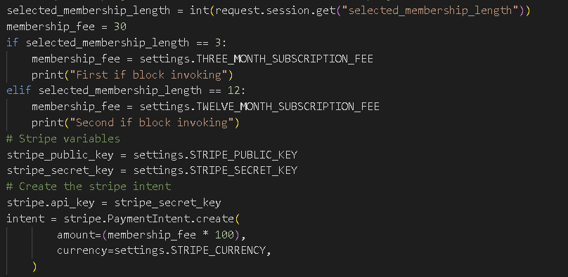

<!-- TOC start (generated with https://github.com/derlin/bitdowntoc) -->

- [Testing](#testing)
   * [Bugs and issues during development](#bugs-and-issues-during-development)
   * [Validator testing](#validator-testing)
      + [HTML validation](#html-validation)
      + [CSS validation](#css-validation)
      + [JSHint validation](#jshint-validation)
      + [Python validation](#python-validation)
   * [Lighthouse testing](#lighthouse-testing)
   * [User story testing](#user-story-testing)
   * [Manual testing](#manual-testing)
      + [Responsiveness](#responsiveness)
      + [Browser testing](#browser-testing)
      + [Website functionality testing](#website-functionality-testing)

<!-- TOC end -->

<!-- TOC -->
# Testing

<!-- TOC -->
## Bugs and issues during development

| Feature | Outcome | Fix Performed | Result | Fixed/Unfixed |
|---------|-------------------|-------------------|--------|------|
|Exercise list item link| The item anchors were also taking up space below the parent containers so a user could click on white space and be led to another page |Restructured the layout and moved the image out of its own separate container into the same div col container where descriptive content is located instead|The anchor now sticks to the height of its parent container and does not go beyond that | ✅ Fixed |

**IMAGE OF PROBLEM**

**IMAGE AFTER FIX**

**IMAGE OF CODE FIX**

| Feature | Expected Outcome | Outcome |Fix Performed | Result |
|---------|-------------------|-------------------|--------|-------------------|
|Deactivate memberships task|Memberships will be deactivated at the stipulated time in the APScheduler (00:00) |The task and APScheduler both worked correctly to perform this job of deactivating memberships. There was a side effect of the code however which was that it was querying the database prior to app initialisation which our code does not really like.|The way we made query's in our tasks.py was refactored to mitigate this problem. Other options were considered such as using Redis and Celery, however these are out of the scope of this project. Some fixes were attempted however these other task schedulers and job performers are not compatible with the version of Django used in this project. In the instance of a failure membership benefits checks have another layer which checks membership end date not only activity so this will not be a problem|✅Problem fully fixed, extra layer of authentication added to membership checks, now using membership end date on top of membership is active|

**IMAGE OF PROBLEM**

**IMAGE AFTER FIX**

**IMAGE OF CODE FIX**

| Feature | Expected Outcome | Outcome |Fix Performed | Result |
|---------|-------------------|-------------------|--------|-------------------|
|Dynamic stripe charges|If a user adjusts the membership length the price is updated|Price not updated|An if check was added to dynamically set the amount variable|✅Fully fixed|

**IMAGE OF PROBLEM**

**IMAGE AFTER FIX**

**IMAGE OF CODE FIX**

<!-- TOC -->
## Validator testing

To validate all of our pages we went through all the validators and validated every available page of the website. CSS stylesheets is the only exception here considering I only have 1 CSS stylesheet and you only need to validate the stylesheets available.

<!-- TOC -->
### HTML validation

To validate our HTML we used the [W3C Validator](https://validator.w3.org/) and placed each individual page 

A couple of problems found within the validations cause by how allauth created the forms, these can be safely ignored. 

[Home page](https://validator.w3.org/nu/?doc=https%3A%2F%2Fpro-gainer-85d1fcf0b9b4.herokuapp.com%2F)

[Signup page](https://validator.w3.org/nu/?showsource=yes&doc=https%3A%2F%2Fpro-gainer-85d1fcf0b9b4.herokuapp.com%2Faccounts%2Fsignup%2F)

[Sign in page](https://validator.w3.org/nu/?showsource=yes&doc=https%3A%2F%2Fpro-gainer-85d1fcf0b9b4.herokuapp.com%2Faccounts%2Flogin%2F)

[Sign out page](https://validator.w3.org/nu/?showsource=yes&doc=https%3A%2F%2Fpro-gainer-85d1fcf0b9b4.herokuapp.com%2Faccounts%2Flogout%2F)

[Exercise list page](https://validator.w3.org/nu/?showsource=yes&doc=https%3A%2F%2Fpro-gainer-85d1fcf0b9b4.herokuapp.com%2Fexercise%2Fexercise_list%2F)

[Exercise detail page](https://validator.w3.org/nu/?showsource=yes&doc=https%3A%2F%2Fpro-gainer-85d1fcf0b9b4.herokuapp.com%2Fexercise%2Fsit-up)

Membership checkout page

Unable to HTML validate membership page on deployed version, stripe integration cause this to not be possible. We instead used the page source for the deployed version.

[Checkout success page](./static/images/testing/html_validator_checkout_success_page.PNG)

[Favourite list page](./static/images/testing/html_validator_favourite_exercises_page.PNG)

[My profile page](./static/images/testing/html_validator_my_profile_page.PNG)

<!-- TOC -->
### CSS validation

To validate our CSS stylesheet we used the [W3C Jigsaw validator](https://jigsaw.w3.org/css-validator/)

No problems found in our CSS validations

CSS Stylesheet
[CSS Stylesheet](https://jigsaw.w3.org/css-validator/validator?uri=https%3A%2F%2Fpro-gainer-85d1fcf0b9b4.herokuapp.com%2F&profile=css3svg&usermedium=all&warning=1&vextwarning=&lang=en)

<!-- TOC -->
### JSHint validation

To validate our Javascript we are using the [JSHint validator](https://jshint.com/)
Our JS validation went well, a few missing colons and warnings about variables. The warnings about variables can be safely ignored, these are variables like Stripe which is available however not declared so JShint acts up a bit.

calculate_membership_fees.js

stripe_elements.js

<!-- TOC -->
### Python validation

All python validation has been performed using the [CI pep8 python linter](https://pep8ci.herokuapp.com/). This application displays any mistakes and assists in making sure our code is python code is pep8 compliant. Every application has been listed below including exercise and membership apps as well as the pro_gainer project level folder. Every single .py file within each folder has been ran through validation to ensure the website conforms to the pep8 standards.

**Exercise app**

admin.py

apps.py

forms.py

models.py

test_forms.py

test_models.py

test_urls.py

urls.py

views.py

**Membership app**

admin.py

apps.py

conext_processors.py

forms.py

models.py

tasks.py

tests.py

urls.py

utils.py

views.py

webhook_handler.py

webhooks.py

**Pro_gainer project folder**

settings.py

urls.py

views.py

<!-- TOC -->
## Lighthouse testing

Using the chrome developer tools we did the lighthouse testing to give a general overview of the site quality, more about this [Here](https://developer.chrome.com/docs/lighthouse/overview).

Each lighthouse test was done on incognito mode with the deployed version. Very high points overall, some points lost on performance specifically across the board. Points of performance were lost primarily from heroku delays, code imports and image loads. I had a look at the code imports like our CDN's if we could save some there, however there is no room to save. All imports are required across the website, the one potential saving is on Stripe which in theory is only used in the checkout page. Stripe documentation recommends for us to keep the imports globally available for their more advanced security features however so this will be left alone, security must always be prioritised over performance improvements.

Home page

Signup page

Sign in page

Sign out page

Exercise list page

Exercise detail page

Membership checkout page

Checkout success page

Favourite exercise list page

My profile page

./static/images/testing

<!-- TOC -->
## User story testing

| Story | Expected functionality | Result | Pass/Fail/Potential improvements |
|---------|-------------------|-------------------|-----------|
|As a user, I would like access to a navigation bar and footer so I can easily navigate the website(Must have)|Navigation bar always present regardless of where the user is on the website|Navbar is always available|✅Passed|
|As a user, I would like the site to be responsive so I can access it on multiple devices(Must have)|Each page responds well to window resizing and displays well on multiple screen sizes|All pages display well on multiple screen sizes, some adjustments made to home page header|✅Passed|
|As a user, I would like to have access to a list of exercises so that I can gather inspiration for my next workout(Must have)|An exercise list is available for every user|A exercise list page is available for every user to access|✅Passed|
|As a user, I would like to have access to details of each exercise so I can get a better grasp of each individual exercise(Must have)|A exercise detail page is available and users can access this to find out more details about each individual exercise|Exercise detail pages are available with all necessary information|✅Passed|
|As an interested customer, I would like to be able to register, sign in and sign out so I can access my membership benefits(Must have)|There is an authentication system atleast including signup, login and logout|There is a full authentication system which can be further expanded, this was created with Allauth. Signup, login and logout pages are all available|✅Passed|
|As an interested customer, I would like to be able to subscribe for a membership so I can access premium website functionality(Must have,this user story was originally --As an interested customer, I would like to be able to pay for my membership with a recurring fee so I dont need to worry about paying. This user story was altered after initially setting this due to being out of scope of the project.)|Members can pay for a membership to gain access to website functionality for a limited time|Membership system has been implemented fully. Users can signup for a membership and gain access to premium features for the period which they have paid for. When memberships expire users lose access to this premium functionality. Rather than having subscriptions which would be out of scope, we have instead implemented individual payments, this extra work problem has been mitigated by users having data saved so they dont need to input them repetitively and our membership lengths are every quater or annum rather than monthly|✅Passed|
|As a signed-in user, I would like to be able to save exercises as favourites so I can easily come back to them(Must have)|There is a functionality to be able to save any individual exercise to the user's favourites list. This functionality is the heart icon located on every exercise detail page|The heart icon has been added to every exercise detail page and is accessible to all members. This dynamically adjusts styles to allow users to see if an exercise is already favourited or not|✅Passed|
|As an admin, I would like to be able to Create new exercises for the website(Must have)|Admins should have access to a form where they can add new exercises|Admins have access to an add exercise button at the exercise list and they can add exercises|✅Passed|
|As an admin, I would like to be able to Edit exercises within the website(Must have)|Admins have a way to access a form where they can edit the already existing instances of exercises on the page|There is an edit button which admins have access to on every single exercise detail page. The button leads to a form with pre filled information of the already existing exercise|✅Passed|
|As an admin, I would like to be able to Delete exercises within the website(Must have)|Admins have access to delete any exercise|Each exercise detail page gives admins access to a delete button which will delete the corresponding exercise|✅Passed|

*Out of scope user stories*

|As a user, I would like to be informed of any discounts the gym may be doing so I can save money(Should have)|||Out of scope not done|
|As a user, I would like to have access to a gallery so I can view pictures of the gym and understand if it is right for me(Could have)|||Out of scope not done|
|As a user, I would like to be able to book a visit so I can decide if the gym is right for me(Could have)|||Out of scope not done|
|As a signed-in user, I would like to be able to cancel my membership so I can stop my gym payments(Originally Must have, now Wont do as recurring payments
 will no longer be applied in the project there is no further need for a cancel membership functionality)|||Out of scope not done|
|As a signed-in user, I would like to be able to filter the exercises in my favourites list so I can easily access specific exercises (Should 
 have)|||Out of scope not done|
|As a signed-in user, I would like to be able to add my fitness goals 
 so I can have them on my profile(Should have)|||Out of scope not done|
|As a signed-in user, I would like to be able to update my fitness goals so I can keep it updated(Should have)|||Out of scope not done|
|As a signed-in user, I would like to receive personalised workouts which are based on my goals so I can get better results faster(Could 
 have)|||Out of scope not done|
|As a signed-in user, I would like to be able to search for exercise content on the exercise list so I can find exercises faster(Could have)|||Out of scope not done|
|As a signed-in user, I would like to be able to filter exercise search results on the exercise list so I can find exercises faster(Could have)|||Out of scope not done|

## Automated testing

Automated testing was performed inside the exercise application, we have generated a coverage report for the created automated tests. Anyone can generate this report using the command **start htmlcov\index.html**. This will open an already generated browser readable report and you can look at the coverage in detail. We achieved an overall coverage of 53%, you can find a screenshot of the report below as well.

<!-- TOC -->
## Manual testing

<!-- TOC -->
### Responsiveness

For my responsiveness testing I used the app [Responsively app](https://responsively.app/)

Initially I had a problem with the my profile page on mobile but that was an easy fix and no further problems

|Screen Size|Device Type|Viewport Width|Pass/Fail|
|-----------|-----------|--------------|---------|
|Mobile|Smartphone|375px| ✅Passed|
|Tablet|Tablet |768px| ✅Passed|
|Laptop|Small Laptop/Desktop|1024px| ✅Passed|

<!-- TOC -->
### Browser testing

|Browser|Not Functioning|Partial Functioning|Full Functioning|
|-------|---------------|-------------------|----------------|
|<i class="fab fa-chrome"></i>Google Chrome| | |✅Passed|
|<i class="fab fa-firefox-browser"></i>Mozilla Firefox| | |✅Passed|
|<i class="fab fa-edge"></i>Microsoft Edge| | |✅Passed|

<!-- TOC -->
### Website functionality testing

Nav bar
| Feature | Expected Outcome | Testing Performed | Pass/Fail/Potential improvements |
|---------|-------------------|-------------------|-----------|
|The company logo is displayed|You can see the logo on each page|Visual check||
|Conditional displaying|If the user is not logged in the membership button is not there|Visual check|✅Passed|
|Condition displaying|If the user is not logged in the profile icon is not there|Visual check|✅Passed|
|Conditional displaying|If the user is not logged in the signup button is there|Visual check|✅Passed|
|Conditional displaying|If the user is not logged in the Login button is there|Visual check|✅Passed|
|Conditional displaying|If the user is logged in the membership button is displayed|Visual check|✅Passed|
|Conditional displaying|If the user is logged in the view profile icon is displayed|Visual check|✅Passed|
|Conditional displaying|If the user is logged in and an active member the favourites list is present|Visual check|✅Passed|
|User redirection|On click of the home page the user is redirected to the home page|Click link|✅Passed|
|User redirection|On click of the company logo the user is redirected to the home page|Click link|✅Passed|
|User redirection|On click of the exercise list the user is redirected to the exercise list page|Click link|✅Passed|
|User redirection|On click of the membership button the user is redirected to the membership checkout page|Click link|✅Passed|
|User redirection|On click of the My favourites link the user is redirected to the favourites list|Click link|✅Passed|
|User redirection|On click of the logout link the user is redirected to the logout confirmation page|Click link|✅Passed|
|User redirection|On click of the my profile page the user is redirected to their my profile page|Click link|✅Passed|
|CTA styles|The signup button stands out with a different style to other nav links|Visual check|✅Passed|
|CTA styles|The login button stands out with a different style to other nav links|Visual check|✅Passed|
|Active nav link|If the user is on the corresponding nav link's page then the link is bold|Visual check|✅Passed|
|Hover styles|If not hovering the nav links there is no underline|Visual check|✅Passed|
|Hover styles|On hover of the nav links a line transitions under it|Hover over nav links|✅Passed|
|Hover styles|On remove of the mouse over the nav links the line transition disappears from under it|Hover over nav links|✅Passed|

Home page
| Feature | Expected Outcome | Testing Performed | Pass/Fail/Potential improvements |
|---------|-------------------|-------------------|-----------|
|Page title|Page title is displayed in the tab|Visual check|✅Passed|
|Hero image|The hero image displays well on multiple devices|Window resize|✅Passed|
|Brand header|The brand header displays well on multiple devices|Visual check and window resize|✅Passed|
|Membership description|All the information is displayed well and is correct|Visual check|✅Passed|
|Membership section CTA|The membership button redirects to the membership page|Press button|✅Passed|
|Membership section CTA|The membership button displays if the user is authenticated|Visual check|✅Passed|
|Membership section CTA|The signup button redirects to the signup page|Click the button|✅Passed|
|Membership section CTA|The signup button displays if the user is not authenticated|Visual check|✅Passed|
|Join us now overlay|The join us now overlay displays well on all screen sizes|Window resize|✅Passed|
|Join here button|If the user is not authenticated redirects to the signup page|Click button|✅Passed|
|Join here button|If the user is authenticated redirects to the membership form|Click button|✅Passed|
|Cards section|Cards display well on all screen sizes|Window resize|✅Passed|
|Nav link|The home nav link is bold|Visual check|✅Passed|

Exercise List page
| Feature | Expected Outcome | Testing Performed | Pass/Fail/Potential improvements |
|---------|-------------------|-------------------|-----------|
|Exercises intro|The exercise introduction displays well on multiple screen sizes|Window resize|✅Passed|
|Add exercise btn|The button is present for admins|Visual check|✅Passed|
|Add exercise btn|The button is not present for regular users|Visual check|✅Passed|
|Add exercise btn|The button redirects to the add exercise form|Click button||
|Exercise list|All exercises are displayed|Visual check|✅Passed|
|Exercise card|Each exercise card displays the required information title, difficulty, muscles targeted, equipment and image|Visual check|✅Passed|
|Exercise card|Each exercise card can be clicked|Click card|✅Passed|
|Exercise card|Each exercise card redirects to the corresponding detail page|Click card|✅Passed|
|Exercise card|Each card displays as the same size as the card next to it|Visual check|✅Passed|
|Exercise card|Each card displays with an alt tag equivalent to the input exercise title||✅Passed|
|Exercise list|The exercises are organised as newest first|Add an exercise and do a visual check|✅Passed|
|Exercise card|The information in each card is displayed by importance|Visual check|✅Passed|
|Pagination|The current page is displayed properly|Visual check|✅Passed|
|Pagination|The total amount of pages is displayed properly|Visual check|✅Passed|
|Pagination|Given enough exercises there is a next page button|Visual check|✅Passed|
|Pagination|The next page button works properly|Click button|✅Passed|
|Pagination|Given enough exercises there is a last page button|Visual check|✅Passed|
|Pagination|The last page button works properly|Click button|✅Passed|
|Pagination|Given enough exercises there is a previous page button|Visual check|✅Passed|
|Pagination|The previous page button works properly|Click button|✅Passed|
|Pagination|Given enough exercises there is a first page button|Visual check|✅Passed|
|Pagination|The first page button works properly|Click button|✅Passed|

Exercise Details page 
| Feature | Expected Outcome | Testing Performed | Pass/Fail/Potential improvements |
|---------|-------------------|-------------------|-----------|
|Edit button|The edit button is displayed for admins|Visual check|✅Passed|
|Deletebutton|The delete button is displayed for admins|Visual check|✅Passed|
|Edit button|The edit button works properly|Click button|✅Passed|
|Delete button|The delete button works properly|Click button|✅Passed|
|Exercise image|The image displays well on multiple device sizes|Visual check|✅Passed|
|Exercise information|All exercise information is displayed|Visual check|✅Passed|
|Favourite exercise icon|Icon is present|Visual check|✅Passed|
|Favourite exercise icon|Icon starts out black and not favourited|Visual check|✅Passed|
|Favourite exercise icon|Icon has a indicator next to it|Visual check|✅Passed|
|Favourite exercise icon|Icon is clickable|Click icon|✅Passed|
|Favourite exercise icon|Icon becomes red on click if black|Click icon|✅Passed|
|Favourite exercise icon|Icon becomes black on clik if red|Click icon|✅Passed|
|Favourite exercise icon|If the icon is black and clicked the exercise is added to the user favourites|Click icon and check|✅Passed|
|Favourite exercise icon|If the icon is red and clicked the exercise is removed from the user favourites|Click icon and check|✅Passed|

Favourite Exercises list page
| Feature | Expected Outcome | Testing Performed | Pass/Fail/Potential improvements |
|---------|-------------------|-------------------|-----------|
|Favourites intro|Intro is displayed well on multiple device sizes|Window resize|✅Passed|
|Favourites list|Favourite exercises is displayed|Visual check|✅Passed|
|Favourites list|Favourite exercises is displayed by newest first|Visual check|✅Passed|
|Favourites list|If there are no favourites yet the users has a feedback message|Visual check|✅Passed|
|Exercise card|All information is displayed properly such as image, title, difficulty, muscles targeted and equipment|Visual check|✅Passed|
|Exercise card|All information is displayed by importance title first, then difficulty, muscles and equipment last|Visual check|✅Passed|
|Exercise card|Each card can be clicked to redirect to the exercise page|Click card||
|Exercise card|Each card redirects to the corresponding exercise detail page|Click card|✅Passed|
|Exercise card|Each exercise image displays an alt tag equivalent to the exercise title|Check dev tools|✅Passed|
|Pagination|The current page is displayed properly|Visual check|✅Passed|
|Pagination|The total amount of pages is displayed properly|Visual check|✅Passed|
|Pagination|Given enough exercises there is a next page button|Visual check|✅Passed|
|Pagination|The next page button works properly|Click button|✅Passed|
|Pagination|Given enough exercises there is a last page button|Visual check|✅Passed|
|Pagination|The last page button works properly|Click button|✅Passed|
|Pagination|Given enough exercises there is a previous page button|Visual check|✅Passed|
|Pagination|The previous page button works properly|Click button|✅Passed|
|Pagination|Given enough exercises there is a first page button|Visual check|✅Passed|
|Pagination|The first page button works properly|Click button|✅Passed|

Add, edit & Delete exercise page
| Feature | Expected Outcome | Testing Performed | Pass/Fail/Potential improvements |
|---------|-------------------|-------------------|-----------|
|Exercise form|The form displays well on difference device sizes|Window resize|✅Passed|
|Exercise form|All inputs are present|Visual check|✅Passed|
|Label inputs|All inputs have a corresponding label|Visual check|✅Passed|
|Label inputs|If an input is required the label has an asterisk|Visual check|✅Passed|
|Label inputs|If an input is not required there is no asterisk on the label|Visual check|✅Passed|
|Exercise title|Must be unique|Add an already added title and submit|✅Passed|
|Difficulty|Contains easy, medium and difficult selections|Visual check|✅Passed|
|Difficulty|Users cannot type|Attempt to type|✅Passed|
|Recommended sets|Users can only add integers|Type|✅Passed|
|Recommended reps|Users can only add integers|Type|✅Passed|
|Intensity|The options are light, moderate and intense|Visual check|✅Passed|
|Intensity|Users cannot type|Attempt to type|✅Passed|
|Form instance|If editing an exercise the information is pre-filled with the previous data|Visual check|✅Passed|
|Form instance|If editing an exercise the selected instance is edited |Submit and check|✅Passed|
|Form instance|If editing an exercise a new instance is not created|Submit and check|✅Passed|
|Form|On form submission the data is added to the database|Submit form|✅Passed|
|Form|If filled out incorrectly the form is not submitted|Add incorrect data and submit|✅Passed|

My profile
| Feature | Expected Outcome | Testing Performed | Pass/Fail/Potential improvements |
|---------|-------------------|-------------------|-----------|
|Information displayed|All information is displayed|Visual check|✅Passed|
|Responsiveness|All information displays well |Visual check|✅Passed|
|Responsiveness|Information collapses into 1 column on xs devices|Window resize|✅Passed|
|Responsiveness|Information displays as label on the left and user information on the right|Window resize|✅Passed|
|Information update|If information is updated this reflects on thsis page|Refill membership and check|✅Passed|

Membership signup page
| Feature | Expected Outcome | Testing Performed | Pass/Fail/Potential improvements |
|---------|-------------------|-------------------|-----------|
|Membership into|Intro displays well on multiple devices|Window resize|✅Passed|
|Form input label|Each input has a corresponding label|Visual check|✅Passed|
|Form input label|Each required input label has an asterisk|Visual check|✅Passed|
|Form input label|Unrequired inputs label does not have an asterisk|Visual check|✅Passed|
|Fieldset legend|Each fieldset section has a legend label |Visual check|✅Passed|
|Form|The form propagates data to the backend on submit |Add data, submit and check|✅Passed|
|Form|The form has the POST method|Inspect element||
|Payment summary|Initially set to nothing here text and fill out the form|Visual check|✅Passed|
|Payment summary|On fill out of the desired membership length update the payment summary membership costs|Select and check|✅Passed|
|Payment summary|On fill out of the desired membership length update the payment Joining fee|Select and check|✅Passed|
|Payment summary|On fill out of the desired membership length update the payment summary total payment costs|Select and check|✅Passed|
|Payment summary|If the joining fee is changed in settings this is reflected on the membership page|Update and check|✅Passed|
|Payment summary|If the membership costs is changed in settings this reflects in the membership page|Change settings global prices and check|✅Passed|
|Payment summary|If there is a joining fee this is calculated properly and added to the membership costs for the total|Change joining fee in settings.py and check|✅Passed|
|Payment summary|This summary displays well on multiple devices|Window resize|✅Passed|
|Stripe element|The stripe element displays well on multiple devices|Window resize|✅Passed|
|Stripe element|The stripe element follows the input design across all pages of the site|Visual check|✅Passed|
|Stripe element|The card number should work with 4242424242424242|Type and submit|✅Passed|
|Stripe element|The card number needs to be 16 digits long|Type shorter and test|✅Passed|
|Stripe element|The card expiry date must be placed to work|Submit without the expiry|✅Passed|
|Stripe element|If the card expiry input is in the past display an error message |Input a past date and submit|✅Passed|
|Stripe element error handling|Error messages display properly|Incorrectly fill out the element and check the error|✅Passed|
|Stripe element|A CVC must be input or the form will not submit|Dont fill out CVC and submit|✅Passed|
|Stripe element|If a CVC is not input display an error|Input incorrect CVC and submit|✅Passed|
|Form|If anything is filled out incorrectly in the form it does not submit |Add invalid data and submit|✅Passed|

Membership success page
| Feature | Expected Outcome | Testing Performed | Pass/Fail/Potential improvements |
|---------|-------------------|-------------------|-----------|
|Thank you message|Thank you message displayed with some page intro below|Visual check|✅Passed|
|Information displayed|All information is displayed|Visual check|✅Passed|
|Responsiveness|All information displays well |Visual check|✅Passed|
|Responsiveness|Information collapses into 1 column on xs devices|Window resize|✅Passed|
|Responsiveness|Information displays as label on the left and user information on the right|Window resize|✅Passed|
|Information update|If information is updated this reflects on thsis page|Refill membership and check|✅Passed|
|Home button|Home button is displayed|Visual check|✅Passed|
|Home button|Home button redirects to the home page|Click btn|✅Passed|
|My profile|My profile button is displayed|Visual check|✅Passed|
|My profile|My profile button redirects to the my profile page|Click btn|✅Passed|

Signup page
| Feature | Expected Outcome | Testing Performed | Pass/Fail/Potential improvements |
|---------|-------------------|-------------------|-----------|
|Page header|Page header displays well on multiple devices|Window resize||
|Email address|User emails must be input twice|Add once and submit||
|Email address|Both emails input must be the same|Input different emails and submit||
|Password|Password characters should be bullets|Type in characters||
|Password|Passwords must meet certain criteria|Dont meet all criteria and submit||
|Password|Password must be the same in both inputs|Input different ||
|Input labels|Each input has a corresponding label|Visual check||
|Input labels|Required input labels have an asterisk next to them|Visual check||
|Input labels|Non required input labels dont have an asterisk next to them|Visual check||
|Form submission|If the form is valid the form submits|Submit form with correct input data||
|Form submission|If the form is not valid the form does not submit|Submit form with incorrect input data||
|Form submission|If the form is valid the new account is created and added to the database|Submit and check DB||
|Form submission|If the form is invalid the data is not propagated to the database| Submit incorrectly and check DB||
|Form submission|If the form is correclty filled out and submitted the user is automatically logged in|Fill out form and submit||
|Form submission|If the form is correctly filled out and submitted the user is logged in and displayed a feedback message|Fill out form and submit||

Login page
| Feature | Expected Outcome | Testing Performed | Pass/Fail/Potential improvements |
|---------|-------------------|-------------------|-----------|
|Page header|Page header displays well on multiple devices|Window resize||
|Password|Password characters should be bullets|Type in characters||
|Input labels|Each input has a corresponding label|Visual check||
|Input labels|Required input labels have an asterisk next to them|Visual check||
|Form submission|If the form is valid the form submits|Submit form with correct input data||
|Form submission|If the form is not valid the form does not submit|Submit form with incorrect input data||
|Feedback messages|If the user inputs correct data and submits a successful login message is displayed|Login||
|Feedback messages|If the user inputs incorrect data and submits a error message is displayed|Input incorrect data and submit||
|Sign up link|The sign up button redirects the user to the sign up page|Click the button||
|Forgot your password|The forgot your password link redirects the user to the forgot your password page|||

Password reset page
| Feature | Expected Outcome | Testing Performed | Pass/Fail/Potential improvements |
|---------|-------------------|-------------------|-----------|
|Form|The form displays well on multiple device sizes|Window resize||
|Email input|The email input is present|Visual check||
|Reset my password button|There is a reset my password button|Visual check||
|Reset my password button|If the input is not an email HTML validation stops the form submission|Incorrectly input an email and submit||
|Reset my password button|If the email is input correctly and submitted the user is redirected to a password successfully set page|||

Password successfully reset page
| Feature | Expected Outcome | Testing Performed | Pass/Fail/Potential improvements |
|---------|-------------------|-------------------|-----------|
|Introduction|The page has a header and content letting the user know the password reset request has been made|||
|Home button|There is a home button on the page|Visual check||
|Home button|The home button redirects the user to the home page|Click button||

Sign out page
| Feature | Expected Outcome | Testing Performed | Pass/Fail/Potential improvements |
|---------|-------------------|-------------------|-----------|
|Header|A header is present to display the purpose of the page|Visual check||
|Sign out button|There is a button to sign out|Visual check||
|Sign out button|The sign out button redirects the user to the home page|Click btn||
|Sign out button|The sign out button signs the user out|Click button||
|Sign out button|If the user is signed in on another page and signs out, the other page is also signed out|Click button and refresh other page||

Footer
| Feature | Expected Outcome | Testing Performed | Pass/Fail/Potential improvements |
|---------|-------------------|-------------------|-----------|
|Social media icons|Icons are present on the top of the footer and display well on multiple devices|Visual check and window resize||
|Social media icons|Icons change color on hover|Hover mouse||
|Social media icons|Icons open the corresponding social media page|Click icon||
|Social media icons|Icons open the social media page in a new tab|Click icon||
|Footer information|Information displays well on multiple screen sizes|Window resize||
|Footer links|Start with an underline|Visual check||
|Footer links|On hover the underline is removed|Hover mouse||
|Footer links|On remove of hover the underline reappears|Hover mouse then remove||
|Footer links|Footer links opens the corresponding website|Click link||
|Footer links|Footer links open the link on a new tab|Click link||
